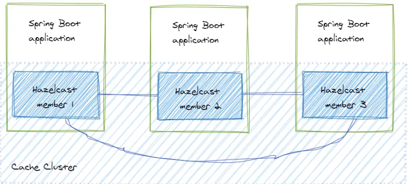
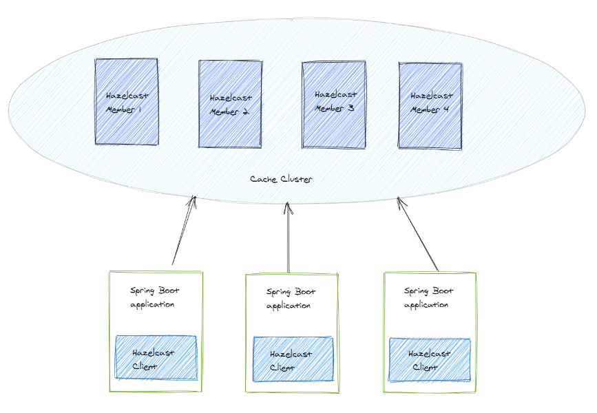
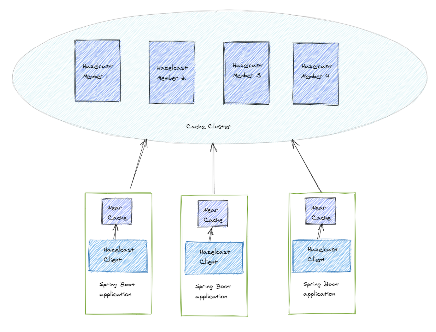

# **Caching**

Normally, an application reads data from storage, for example, from a database. If we want to increase the performance of reading or writing data, we can improve the hardware and make it faster. But this costs money.

If the data in the external storage doesn’t change very fast, we can create copies of this data in smaller but much faster storage. These copies are store temporarily. Usually, we use RAM for such fast storage.

This is what we call a cache.

If the application wants to access data, it requests the data in the cache. We know that the data in the cache are copies, and we cannot use them for a long time because the data in the primary storage can change. In this case, we would get a data inconsistency.

That’s why we need to define the validity time of the data in the cache. Also, we don’t want data in the cache that is not frequently requested. This data would only allocate resources of the cache but wouldn’t be used. In this case, we configure the time how long a data lives in the cache if it is not requested.

This is what we call time-to-live (TTL).

In a big enterprise system, there can be a cluster of caches. We have to replicate and synchronize the data in this cluster between the caches.

This, we call write-through concept.

## **Hazelcast as a Distributed Cache**

Let’s say we have a Spring Boot application, and we want to use a cache in the application. But we also want to be able to scale this application. This means, when we start three instances of the application, for example, that they have to share the cache to keep the data consistent.

We solve this problem by using a distributed cache.

Hazelcast is a distributed in-memory object store and provides many features including TTL, write-through, and scalability. We can build a Hazelcast cluster by starting several Hazelcast nodes in a net. Each node is called a member.

There are two types of topologies we can implement with Hazelcast:

1. embedded cache topology, and
2. client-server topology. 
   1. Near Cache


Let’s have a look at how to implement each topology with Spring.

### 1. Embedded Cache Topology

This topology means that every instance of the application has an integrated member:



#### **Embedded Cache Topology**

In this case, the application and the cache data are running on the same node. When a new cache entry is written in the cache, Hazelcast takes care of distributing it to the other members. When data is read from the cache, it can be found on the same node where the application is running.

#### **Embedded Cache with Spring**

Let’s have a look at how to build a cluster with an embedded Hazelcast cache topology and a Spring application. Hazelcast supports many distributed data structures for caching. We will use a Map because it provides the well-known get and put operations.

First, we have to add the Hazelcast dependency. Hazelcast is just a Java library, so that can be done very easily (Gradle notation):
````
compile group: 'com.hazelcast', name: 'hazelcast', version: '4.0.1'
````
Now let’s create a cache client for the application.
````
@Component
class CacheClient {

public static final String CARS = "cars";
private final HazelcastInstance hazelcastInstance
= Hazelcast.newHazelcastInstance();

public Car put(String number, Car car){
IMap<String, Car> map = hazelcastInstance.getMap(CARS);
return map.putIfAbsent(number, car);
}

public Car get(String key){
IMap<String, Car> map = hazelcastInstance.getMap(CARS);
return map.get(key);
}

// other methods omitted

}
````
That’s it. Now the application has a distributed cache. The most important part of this code is the creation of a cluster member. It happens by calling the method Hazelcast.newHazelcastInstance(). The method getMap() creates a Map in the cache or returns an existing one. The only thing we have to do to set the name of the Map.

When we want to scale our application, every new instance will create a new member and this member will join the cluster automatically.

Hazelcast provides several mechanisms for discovering the members. If we don’t configure any discovery mechanism, the default one is used, in which Hazelcast tries to find other members in the same network using multicast.

This approach has two advantages:

it’s very easy to set up the cluster, and
data access is very fast.
We don’t need to set up a separate cache cluster. It means we can create a cluster very fast by adding a couple of lines of code.

If we want to read the data from the cluster, the data access is low-latency, because we don’t need to send a request to the cache cluster over the network.

But it brings drawbacks too. Imagine we have a system that requires one hundred instances of our application. In this cluster topology, it means we would have one hundred cluster members even though we don’t need them. This big number of cache members would consume a lot of memory.

Also, replication and synchronizing would be pretty expensive. Whenever an entry is added or updated in the cache this entry would be synchronized with other members of the cluster, which causes a lot of network communication.

Also, we have to note that Hazelcast is a java library. That means, the member can be embedded in a java application only.

We should use the Embedded cache topology when we have to execute high-performance computing with the data from the cache.

#### **Cache Configuration**

We can configure the cache by passing a Config object into the factory method. Let’s have a look at a couple of the configuration parameters:
````
@Component
class CacheClient {

public static final String CARS = "cars";
private final HazelcastInstance hazelcastInstance
= Hazelcast.newHazelcastInstance(createConfig());

public Config createConfig() {
Config config = new Config();
config.addMapConfig(mapConfig());
return config;
}

private MapConfig mapConfig() {
MapConfig mapConfig = new MapConfig(CARS);
mapConfig.setTimeToLiveSeconds(360);
mapConfig.setMaxIdleSeconds(20);
return mapConfig;
}

// other methods omitted
}
````
We can configure every Map or other data structure in the cluster separately. In this case, we configure the Map of cars.

With setTimeToLiveSeconds(360) we define how long an entry stays in the cache. After 360 seconds, the entry will be evicted. If the entry is updated, the eviction time will reset to 0 again.

The method setMaxIdleSeconds(20) defines how long the entry stays in the cache without being touched. An entry is “touched” with each read operation. If an entry is not touched for 20 seconds, it will be evicted.

### 2. Client-Server Topology

This topology means that we set up a separate cache cluster, and our application is a client of this cluster.



#### Client-Server Cache Topology

The members form a separate cluster, and the clients access the cluster from outside.

To build a cluster we could create a java application that sets up a Hazelcast member, but for this example, we’ll use a prepared Hazelcast server.

Alternatively, we can start a docker container as a cluster member. Every server or every docker container will start a new member of the cluster with the default configuration.

Now we need to create a client to access the cache cluster. Hazelcast uses TCP socket communication. That’s why it’s possible to create a client not only with java. Hazelcast provides a list of clients written in other languages. To keep it simple, let’s look at how to create a client with Spring.

First, we’ll add the dependency to the Hazelcast client:
````
compile group: 'com.hazelcast', name: 'hazelcast', version: '4.0.1'
````
Next, we create a Hazelcast client in a Spring application, similar as we did for the embedded cache topology:
````
@Component
class CacheClient {

private static final String CARS = "cars";

private HazelcastInstance client = HazelcastClient.newHazelcastClient();

public Car put(String key, Car car){
IMap<String, Car> map = client.getMap(CARS);
return map.putIfAbsent(key, car);
}

public Car get(String key){
IMap<String, Car> map = client.getMap(CARS);
return map.get(key);
}

// other methods omitted

}
````
To create a Hazelcast client we need to call the method HazelcastClient.newHazelcastClient(). Hazelcast will find the cache cluster automatically. After that, we can use the cache by using the Map again. If we put or get data from the Map, the Hazelcast client connects the cluster to access data.

Now we can deploy and scale the application and the cache cluster independently. We can have for example 50 instances of the application and 5 members of the cache cluster. This the biggest advantage of this topology.

If we have some problems with the cluster, it’s easier to identify and to fix this issue, since the clients and the cache are separated and not mixed.

This approach has drawbacks, too, though.

Firstly, whenever we write or read the data from the cluster we need network communication. It can take longer than in the approach with the embedded cache. This difference is especially significant for read operations.

Secondly, we have to take care of the version compatibility between the cluster members and the clients.

We should use the client-server topology when the deployment of the application is bigger than the cluster cache.

Since our application now only contains the clients to the cache and not the cache itself, we need to spin up a cache instance in our tests. We can do this very easily by using the Hazelcast Docker image and Testcontainers (see an example on GitHub).

## 2. a. Near-Cache

When we use the client-server topology, we’re producing network traffic for requesting data from the cache. It happens in two cases:

when the client reads data from a cache member, and
when a cache member starts the communication with other cache members to synchronize data in the cache.
We can avoid this disadvantage by using near-cache.

Near-cache is a local cache that is created on a Hazelcast member or the client. Let’s look at how it works when we create a near-cache on a hazelcast client:



#### Near Cahce

Every client creates its near-cache. When an application request data from the cache, it first looks for the data in the near-cache. If it doesn’t find the data, we call it a cache miss. In this case, the data is requested from the remote cache cluster and added to the near-cache. When the application wants to read this data again, it can find it in the near-cache. We call this a cache hit.

So, the near-cache is a second-level cache - or a “cache of the cache”.

We can easily configure a near-cache in a Spring application:
````
@Component
class CacheClient {

private static final String CARS = "cars";

private HazelcastInstance client
= HazelcastClient.newHazelcastClient(createClientConfig());

private ClientConfig createClientConfig() {
ClientConfig clientConfig = new ClientConfig();
clientConfig.addNearCacheConfig(createNearCacheConfig());
return clientConfig;
}

private NearCacheConfig createNearCacheConfig() {
NearCacheConfig nearCacheConfig = new NearCacheConfig();
nearCacheConfig.setName(CARS);
nearCacheConfig.setTimeToLiveSeconds(360);
nearCacheConfig.setMaxIdleSeconds(60);
return nearCacheConfig;
}

// other methods omitted

}
````
The method createNearCacheConfig() creates the configuration of the near-cache. We add this configuration to the Hazelcast client configuration by calling clientConfig.addNearCacheConfig(). Note that this is the configuration of the near-cache on this client only. Every client has to configure the near-cache itself.

Using the near-cache we can reduce network traffic. But it’s important to understand that we have to accept a possible data inconsistency. Since the near-cache has its own configuration, it will evict the data according this configuration. If data is updated or evicted in the cache cluster, we can still have stale data in the near-cache. This data will be evicted later according to the eviction configuration and then we’ll get a cache miss. Only after the data has been evicted from the near-cache will it be read from the cache cluster again.

We should use the near-cache when we read from the cache very often, and when the data in the cache cluster changes only rarely.

## Serialization

The java objects are serialized when stored in the cache. The Car class from above implements Serializable, so, in this case, Hazelcast will use the standard Java serialization.

But the standard Java serialization has drawbacks like high resource usage of CPU and memory.

## Why Customize Serialization?

Imagine we have a scalable system with multiple instances and a cache cluster with few members. The system is working and cache entries are being stored, read, and evicted from the cache. Now we want to change a java class whose objects are cached and often used.

We need to deploy a new version of the application with this new class and we want to do it without downtime. If we start a rolling update of our application instances, it works fine for the application, but the cache still can have entries of the previous version of the objects.

Hazelcast will not be able to deserialize the old version of the objects and throw an exception. It means we should create a serializer, that supports versioning of cache entries and that is able to serialize and deserialize java objects of different versions at the same time.

Hazelcast provides us two options to customize the serialization:

implement a Hazelcast serialization interface type in the classes that should be serialized,
implement a custom serializer and add it to the cache configuration.
Implement the DataSerializable Interface
Hazelcast has a few serialization interface types. Let’s have a look at the interface DataSerializable. This interface is more CPU and memory efficient than Serializable.

We implement this interface in the class Car:
````
class Car implements DataSerializable {

private String name;
private String number;

@Override
public void writeData(ObjectDataOutput out) throws IOException {
out.writeUTF(name);
out.writeUTF(number);
}

@Override
public void readData(ObjectDataInput in) throws IOException {
name = in.readUTF();
number = in.readUTF();
}
}
````
The methods writeData() and readData() serialize and deserialize the object of the class Car. Note that the serialization and the deserialization of the single fields should be done in the same order.

That’s it. Hazelcast will now use the serialization methods. But now we have the Hazelcast dependency in the domain object Car.

We can use a custom serializer to avoid this dependency.

Configure a Custom Serializer
First, we have to implement a serializer. Let’s take the StreamSerializer:
````
class CarStreamSerializer implements StreamSerializer<Car> {

@Override
public void write(ObjectDataOutput out, Car car) throws IOException {
out.writeUTF(car.getName());
out.writeUTF(car.getNumber());
}

@Override
public Car read(ObjectDataInput in) throws IOException {
return Car.builder()
.name(in.readUTF())
.number(in.readUTF())
.build();
}

@Override
public int getTypeId() {
return 1;
}
}
````
The methods write() and read() serialize and deserialize the object Car, respectively. We have to have the same order of writing and reading fields again. The method getTypeId() return the identifier of this serializer.

Next, we have to add this serializer to the configuration:
````
@Component
class CacheClient {

public Config createConfig() {
Config config = new Config();
config.addMapConfig(mapConfig());
config.getSerializationConfig()
.addSerializerConfig(serializerConfig());
return config;
}

private SerializerConfig serializerConfig() {
return  new SerializerConfig()
.setImplementation(new CarSerializer())
.setTypeClass(Car.class);
}
// other methods omitted.
}
````
In the method serializerConfig() we let Hazelcast know that it should use CarSerializer for Car objects.

Now the class Car doesn’t need to implement anything and can be just a domain object.


References: 


# **PORT Forwarding in k8**
````
kubectl port-forward <POD-NAME> 8081:8080
````


# **Importance of RBAC in hazelcast K8 based deployment**

RBAC (Role-Based Access Control) is crucial in a Kubernetes environment for security reasons. It allows you to control who can access the Kubernetes API and what permissions they have.


When deploying a Spring Boot application with Hazelcast on Kubernetes, Hazelcast uses the Kubernetes API for service discovery to find other Hazelcast members in the cluster. To do this, it needs to have the appropriate permissions to read certain Kubernetes resources, such as Endpoints or Pods, depending on the service discovery strategy used.


Without RBAC, Hazelcast wouldn't be able to query the Kubernetes API and therefore wouldn't be able to form a cluster with other Hazelcast members. This is why you need to set up RBAC when deploying Hazelcast on Kubernetes.


Here's an example of a Role and RoleBinding that gives Hazelcast the necessary permissions:

````
apiVersion: rbac.authorization.k8s.io/v1
kind: Role
metadata:
  name: hazelcast-role
rules:
  - apiGroups: [""]
    resources: ["endpoints", "pods", "services"]
    verbs: ["get", "list", "watch"]

---
apiVersion: rbac.authorization.k8s.io/v1
kind: RoleBinding
metadata:
  name: hazelcast-rolebinding
roleRef:
  apiGroup: rbac.authorization.k8s.io
  kind: Role
  name: hazelcast-role
subjects:
  - kind: ServiceAccount
    name: default
````

This configuration allows the default ServiceAccount to read Endpoints, Pods, and Services in the same namespace. Hazelcast uses this ServiceAccount when querying the Kubernetes API.


However it is a good practice to create a dedicated ServiceAccount for your application instead of using the default service account.


A ServiceAccount is an identity in Kubernetes with which processes in a Pod can access Kubernetes APIs. When you create a ServiceAccount, a token is created which is used to authenticate with the Kubernetes API server.


Here's an example of how to create a ServiceAccount and use it in your Deployment:


Create a ServiceAccount:

````
apiVersion: v1
kind: ServiceAccount
metadata:
  name: hz-service-account

````


Bind the Role to the ServiceAccount with a RoleBinding:

````
apiVersion: rbac.authorization.k8s.io/v1
kind: RoleBinding
metadata:
  name: hazelcast-rolebinding
roleRef:
  apiGroup: rbac.authorization.k8s.io
  kind: Role
  name: hazelcast-role
subjects:
  - kind: ServiceAccount
    name: hz-service-account

````
Use the ServiceAccount in your Deployment:
````
apiVersion: apps/v1
kind: Deployment
metadata:
  name: hazel-app
  labels:
    app: hazel-app
spec:
  replicas: 2
  selector:
    matchLabels:
      app: hazel-app
  template:
    metadata:
      labels:
        app: hazel-app
    spec:
      serviceAccountName: hz-service-account
      containers:
        - name: hazel-app
          image: hz-app:0.0.1
          imagePullPolicy: Never
          env:
            - name: HAZELCAST_K8S_SERVICE_NAME
              value: hz-app-service
            - name: environment
              value: K8s
          ports:
            - containerPort: 8080
            - containerPort: 5701
      
         
        
````
In the spec of the Pod template, you can set the serviceAccountName to the name of your ServiceAccount. This tells Kubernetes to run the containers in the Pod with the identity of the specified ServiceAccount, which gives them the permissions defined in the Role that's bound to the ServiceAccount.


Download hazelcast-management-center-5-3-0
from https://hazelcast.com/open-source-projects/downloads/archives/#hazelcast-management-center-5-3-0
unzip folder and run 
